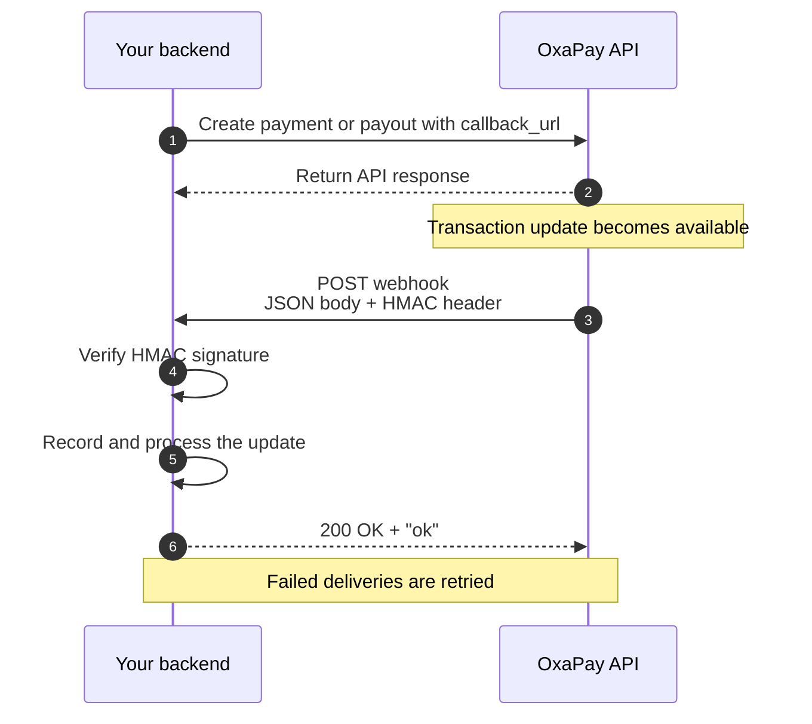

Webhooks let OxaPay notify your backend when a payment or payout update is available.

Instead of repeatedly requesting transaction information from the API, provide a `callback_url` when creating a supported payment or payout. OxaPay sends webhook notifications directly to that URL as JSON over HTTPS.

<Info>
  Webhooks are **server-to-server** notifications. Your `callback_url` must be a publicly accessible HTTPS endpoint that can receive `POST` requests with an `application/json` body.
</Info>

## How webhooks work

A typical OxaPay webhook flow looks like this:

The core flow is:

<Steps>
  <Step title="Create a payment or payout">
    Include your public HTTPS endpoint in the `callback_url` field of a supported request.
  </Step>
  <Step title="Receive the webhook">
    OxaPay sends a JSON payload to your endpoint using an HTTP `POST` request.
  </Step>
  <Step title="Verify the request">
    Validate the `HMAC` header against the raw request body using the API key associated with that webhook type.
  </Step>
  <Step title="Process the update">
    Match the webhook to the corresponding transaction in your system and update your local state.
  </Step>
  <Step title="Acknowledge delivery">
    Return HTTP `200` with `ok` in the response body after the webhook has been accepted successfully.
  </Step>
</Steps>

## The webhook contract

<Columns cols={2}>
  <Card title="Set a callback URL" icon="link">
    Add a public HTTPS endpoint to the `callback_url` field when creating a supported payment or payout.
  </Card>

  <Card title="Receive JSON over HTTPS" icon="server">
    OxaPay delivers webhook notifications using HTTP `POST` requests with an `application/json` body.
  </Card>

  <Card title="Verify every request" icon="shield-check">
    Authenticate the webhook using the `HMAC` header and the raw request body before trusting its contents.
  </Card>

  <Card title="Acknowledge delivery" icon="circle-check">
    Return HTTP `200` with `ok` after you successfully accept the webhook. Failed deliveries are retried automatically.
  </Card>
</Columns>

## Payment and payout webhooks

Payment and payout webhooks use the same delivery pattern, but they are authenticated with different API keys and contain different transaction data.

<Columns cols={2}>
  <Card title="Payment webhooks" icon="credit-card" href="/webhooks/payment-webhooks" cta="Explore payment webhooks" arrow>
    Receive payment updates for supported flows such as invoices, white-label payments, static addresses, payment links, and donations.

    Verify payment webhook signatures using your **Merchant API Key**.
  </Card>

  <Card title="Payout webhooks" icon="send" href="/webhooks/payout-webhooks" cta="Explore payout webhooks" arrow>
    Receive updates for payouts created through the Payout API.

    Verify payout webhook signatures using your **Payout API Key**.
  </Card>
</Columns>

<Warning>
  For payments, do not fulfill an order when the status is `paying`. This status means OxaPay has detected the payment, but it is not yet considered final. Wait for the `paid` status before treating the payment as successfully completed.
</Warning>

## `callback_url` is not `return_url`

These URLs serve different purposes and should not be used interchangeably.

| URL | Purpose |
| --- | --- |
| `callback_url` | A backend HTTPS endpoint where OxaPay sends server-to-server transaction updates. |
| `return_url` | A browser destination where the payer can be redirected after completing a payment flow. |

<Warning>
  Never use a browser redirect to confirm that an order has been paid. Confirm the payment from a verified webhook with the appropriate final status, or retrieve the latest payment information from the API.
</Warning>

## At a glance

| Property | OxaPay webhook behavior |
| --- | --- |
| **Delivery method** | HTTP `POST` |
| **Content type** | `application/json` |
| **Destination** | Public HTTPS `callback_url` |
| **Signature header** | `HMAC` |
| **Signature algorithm** | HMAC-SHA512 |
| **Signed content** | Raw request body |
| **Payment signing key** | Merchant API Key |
| **Payout signing key** | Payout API Key |
| **Successful acknowledgement** | HTTP `200` with response body `ok` |
| **Failed delivery** | Retried automatically, up to 5 delivery attempts |

<Warning>
  Always calculate the signature from the **raw request body** received from OxaPay. Parsing and re-serializing the JSON before calculating the HMAC can change the byte representation and cause signature verification to fail.
</Warning>

## Build a reliable webhook handler

A production webhook endpoint should keep authentication, state updates, and acknowledgement behavior predictable.

<Steps>
  <Step title="Preserve the raw request body">
    Keep the exact request body available so you can calculate the HMAC over the same data that OxaPay signed.
  </Step>
  <Step title="Verify the HMAC signature">
    Read the `HMAC` header and verify it with the correct API key.

    Use your Merchant API Key for payment webhooks and your Payout API Key for payout webhooks. Do not trust or act on webhook data until verification succeeds.
  </Step>
  <Step title="Identify the transaction">
    Use identifiers in the payload, such as `track_id` and any reference you supplied with the original request, to associate the update with the correct record in your system.
  </Step>
  <Step title="Apply the state change safely">
    Store the latest transaction state and run only the business actions appropriate for that state.

    Make side effects such as fulfillment, balance credits, notifications, or downstream jobs safe to run when delivery is retried.
  </Step>
  <Step title="Acknowledge successful receipt">
    After the webhook has been accepted successfully, return HTTP `200` with `ok`.

    If OxaPay does not receive a successful acknowledgement, it may retry the delivery.
  </Step>
</Steps>

<Tip>
  Keep the synchronous webhook path short. Verify the request, durably record or enqueue the update, acknowledge delivery, and perform expensive or long-running work outside the request path when possible.
</Tip>

## Next steps

Choose the guide that matches what you are implementing.

<Columns cols={2}>
  <Card title="Receive webhooks" icon="radio" href="/webhooks/receive-webhooks" arrow>
    Create your endpoint, configure `callback_url`, and receive your first OxaPay webhook.
  </Card>

  <Card title="Verify signatures" icon="shield-check" href="/webhooks/verify-signatures" arrow>
    Learn exactly how OxaPay signs requests and how to validate the `HMAC` header securely.
  </Card>

  <Card title="Payment webhooks" icon="credit-card" href="/webhooks/payment-webhooks" arrow>
    Understand payment webhook payloads, transaction types, statuses, and fulfillment behavior.
  </Card>

  <Card title="Payout webhooks" icon="send" href="/webhooks/payout-webhooks" arrow>
    Handle payout-specific webhook payloads and payout status updates.
  </Card>

  <Card title="Delivery & retries" icon="rotate" href="/webhooks/delivery-retries" arrow>
    Understand successful acknowledgements, retry timing, and reliable processing patterns.
  </Card>

  <Card title="Testing & troubleshooting" icon="wrench" href="/webhooks/testing-troubleshooting" arrow>
    Test webhook delivery and diagnose common endpoint, signature, and delivery problems.
  </Card>
</Columns>

## Related API operations

<Columns cols={2}>
  <Card title="Generate Invoice" icon="file-invoice" href="/api-reference/payment/generate-invoice" arrow>
    Create an invoice and provide a `callback_url` to receive payment updates.
  </Card>

  <Card title="Generate Payout" icon="send" href="/api-reference/payout/generate-payout" arrow>
    Create a payout and provide a `callback_url` to receive payout updates.
  </Card>
</Columns>
